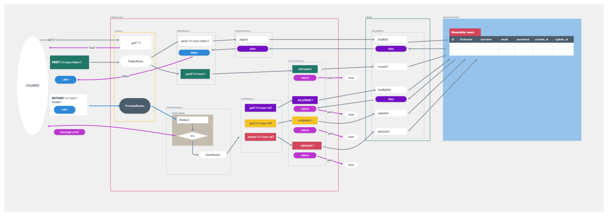
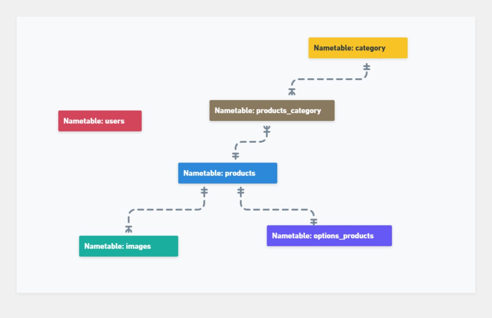
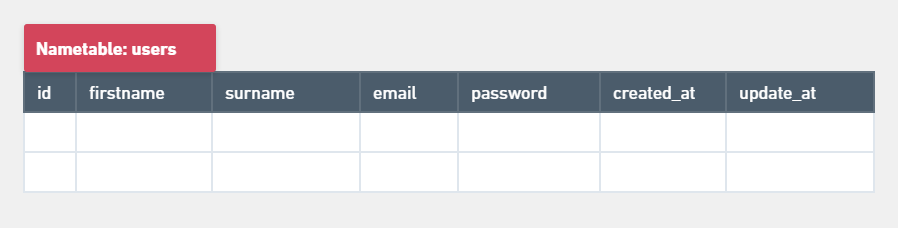
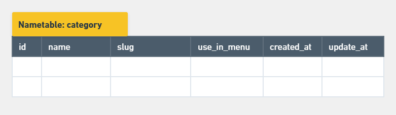
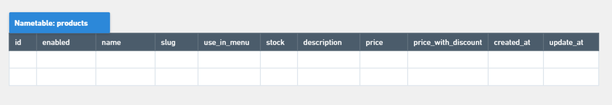
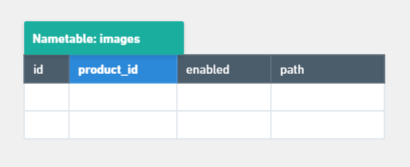
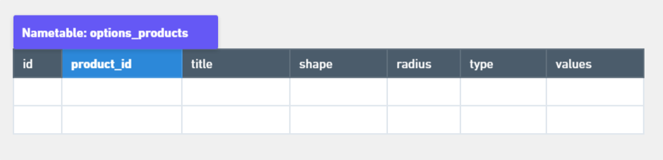
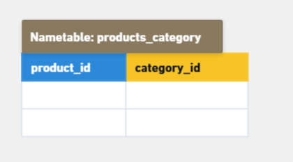

# PROJETO FINAL BACK END GERAÇÃO TECH - 2025

O objetivo do projeto é criar um servidor que consiga responder as requisições do usuário, direcionando para as rotas adequadas, permitindo o CRUD (criar, ler, atualizar e deletar) de dados que estão no Banco de dados. Ainda faz a verificação de usuário, permitindo apenas que os usuários cadastrados tenham acesso integral aos recursos do servidor.

Como a integração do servidor com um projeto Front End não está no escopo, as requisições foram feitas através do programa `Insomnia`.
a ferramenta `Vite`, com a linguagem JavaScript.

A criação faz parte do projeto final Backend do curso de **Desenvolvedor Web Full Stack - Online - 2.0 - 2025**, da Geração Tech, IEL.

O projeto segue os requisitos do projeto `projeto-backend`, da escola `Digital College`, disponibilizado no repositório do site do `GitHub`:

- Link do repositório no GitHub:

```https://github.com/digitalcollegebr/projeto-backend```

## Tecnologias Utilizadas

- Node.js

- Express

- Nodemon

- Dotenv

- MySQL

- Sequelize

- JWT

- Crypto.js

## Sobre o Servidor

O servidor apresenta a rota da página principal (Home), a página para verificar a conta (Login), e páginas para o CRUD de **Usuários**, **Categorias de produtos**, e **Produtos**.

As rotas só estão liberadas depois que o usuário, que for cadastrado, inserir corretamente os dados de e-mail e senha. Então, recebe uma chave temporária (token), que permite acessar as outras rotas do servidor, e com isso, receber, cadastrar, atualizar e deletar informações no banco de dados.

O sistema de gerenciamento de banco de dados utilizado é o `MySQL`.

O projeto segue a arquitetura **MVC** (Model-View-Controller).

<details>
  <summary><strong>Informações</strong></summary>

## Estrutura Lógica do Servidor
A imagem foi criada no site [Whimsical](https://whimsical.com/).



> Nota: como a lógica para as rotas de Categorias e Produtos são semelhantes a rota de Usuários, a imagem mostra apenas a rota, `controller`, `model` e tabela no banco de dados para Usuários.

## Estrutura de pastas

Segue a estrutura de pastas do projeto.

<details>
  <summary><strong>Estrutura</strong></summary>

```
|--- doc/
|--- src/
|--- |--- config/
|          |--- connection.js
|--- |--- controllers/
|          |--- AuthController.js
|          |--- CategoryController.js
|          |--- ProductController.js
|          |--- UserController.js
|--- |--- database/
|          |--- execute.js
|          |--- syncforce.js
|--- |--- models/
|          |--- CategoryModel.js
|          |--- ImageModel.js
|          |--- OptionModel.js
|          |--- ProdCateg.js
|          |--- ProductModel.js
|          |--- userModel.js
|--- |--- routes/
|          |--- CategoryRoutes.js
|          |--- PrivatesRoutes.js
|          |--- ProductRoutes.js
|          |--- PublicRoutes.js
|          |--- UserRoutes.js
|--- .env
|--- .gitignore
|--- README.md
|--- package-lock.json
|--- package.json
|--- server.js
```
</details>

## Tabelas no Banco de Dados

Existem seis tabelas no banco de dados: `usuários`, `categorias`, `produtos`, `imagens do produto`, `opções do produto` e `produtos e categoria`.

<details>
  <summary><strong>Informações</strong></summary>

A imagem representa a estrutura de relacionamento das tabelas:



> Imagem criada no site **Whimsical**.

### 1 - Tabelas

<details>
  <summary><strong>Sobre</strong></summary>

- Tabela de Usuários
 


> Imagem criada no site **Whimsical**.

- Tabela de Categorias



> Imagem criada no site **Whimsical**.

- Tabela de Produtos



> Imagem criada no site **Whimsical**.

- Tabela de Imagens do Produto



> Imagem criada no site **Whimsical**.

- Tabela de Opções do Produto



> Imagem criada no site **Whimsical**.

- Tabela de Produtos e Categoria
  


> Imagem criada no site **Whimsical**.

</details>

</details>

## Rotas

<details>
  <summary><strong>Mais</strong></summary>


### Rotas Públicas
<details>
  <summary><strong>Mais</strong></summary>

- Endereço Home:

```
GET  http://localhost:3000
```

- Endereço para criar usuário (retorno é um ‘token’):

```
POST  http://localhost:3000/v1/user
```

- Endereço para entrar na conta (login):

```
POST  http://localhost:3000/v1/user/token
```
</details>

### Rotas Privadas
<details>
  <summary><strong>Mais</strong></summary>

**Usuários**

- Buscar usuário por ID:

```
GET  http://localhost:3000/v1/user/:id
```

- Atualizar usuário por ID:

```
POST  http://localhost:3000/v1/user/:id
```

- Deletar usuário por ID:

```
DELETE  http://localhost:3000/v1/user/:id
```

**Categorias**

- Buscar todas as categorias:

```
GET  http://localhost:3000/v1/category/search
```

- Buscar categoria por ID:

```
GET  http://localhost:3000/v1/category/:id
```

- Criar categoria:

```
POST  http://localhost:3000/v1/category
```

- Atualizar categoria por ID:

```
POST  http://localhost:3000/v1/category/:id
```

- Deletar categoria por ID:

```
DELETE  http://localhost:3000/v1/category/:id
```

**Produtos**

- Buscar todos os produtos:

```
GET  http://localhost:3000/v1/product/search
```

- Buscar produto por ID:

```
GET  http://localhost:3000/v1/product/:id
```

- Criar produto:

```
POST  http://localhost:3000/v1/product
```

- Atualizar produto por ID:

```
POST  http://localhost:3000/v1/product/:id
```

- Deletar produto por ID:

```
DELETE  http://localhost:3000/v1/product/:id
```
</details>

</details>

</details>

### Instalação
<details>
  <summary><strong>Informações</strong></summary>

- Criar pasta para o projeto, e abrir o VScode nela.

- Criar `package.json`:

```
npm init -y
```

- Instalação da biblioteca Nodemon:

```
npm install --save-dev nodemon
```

- Criar arquivo `server.js`

- Editar arquivo `package.json`:

- Em **main** trocar para server.js;
- Em **scripts**, adicionar: "start": "nodemon server.js"
- Alterar: "author": "Nome",
- Alterar: "description": "texto da descrição"

- Instalação da biblioteca Express:

```
npm install express
```

- Instalação da biblioteca JSON Web Token:

```
npm install jsonwebtoken
```

- Instalação da biblioteca Dotenv:

```
npm install dotenv
```

- Instalação das bibliotecas Sequelize e MySQL2:

```
npm install sequelize mysql2
```

- Instalação da biblioteca CRYPTO-JS:

```
npm install crypto-js
```

- Iniciar o servidor:

```
npm start
```

</details>

## Autor

- GitHub: claussonlucas

## Contribuição

Alguns trechos de códigos foram feitos em parceria com o aluno Clailson Lucas, do curso Desenvolvedor Web Full Stack - Online - 2.0 - 2025, da Geração Tech.

- GitHub: [@clailson1](https://github.com/clailson1)

## Licença

O projeto segue o modelo do projeto `projeto-backend`, da escola `Digital College`, disponibilizado no repositório do site do `GitHub`:

- Link do repositório no GitHub:

 ```[https://github.com/digitalcollegebr/projeto-backend](https://github.com/digitalcollegebr/projeto-backend)```
